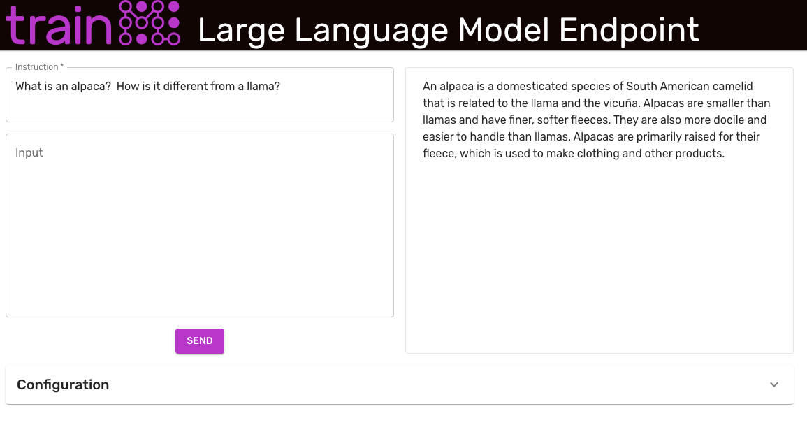

# Alpaca LLM Fine Tuning - trainML Instructions

This repository is a fork of the [Stanford Alpaca](https://github.com/tatsu-lab/stanford_alpaca) repository that contains instructions on how to fine-tune a Large Language Model (LLM) as an instruction-trained model and use the results for inference on the [trainML platform](https://www.trainml.ai/). Running the entire tutorial as described will consume approximately 40 credits ($40 USD). The credit charge can be decreased by changing some of the [training settings](#reducing-training-duration).

> This tutorial is for research and training purposes. You must agree to and follow all license terms of the source code, datasets, and model code. In particular, using the results of this tutorial for commercial purposes is prohibited.

### Prerequisites

Before beginning this example, ensure that you have satisfied the following prerequisites.

- A valid [trainML account](https://auth.trainml.ai/login?response_type=code&client_id=536hafr05s8qj3ihgf707on4aq&redirect_uri=https://app.trainml.ai/auth/callback) with a non-zero [credit balance](https://docs.trainml.ai/reference/billing-credits/).
- The [trainML CLI/SDK](https://github.com/trainML/trainml-cli) installed and [configured](https://github.com/trainML/trainml-cli#authentication).

## Instruction Fine-Tuning

The original Alpaca fine-tuning script required 4 GPUs with 80GB of VRAM each. Since these GPUs are unavailable or in highly constrained supply on most cloud platforms, this training example uses Microsoft's [DeepSpeed](https://github.com/microsoft/DeepSpeed) framework to significantly lower the required VRAM for the training process. Deepspeed is installed on all trainML Python 3.9+ PyTorch environments (including the default Deep Learning environment), with pre-complied extensions/ops.

Using the [Zero](https://www.deepspeed.ai/tutorials/zero/) Stage 2 with optimizer offload and gradient checkpointing, we can successfully train Alpaca on 4 GPUs with 24GB of VRAM each. Although this process takes 3-4 times longer than their original configuration, the $/hour GPU savings of lower VRAM GPUs results in significant total training cost savings (from approximately $100 to less than $40), with the opportunity for [additional cost savings](#reducing-training-duration).

To create the [trainML training job](https://docs.trainml.ai/getting-started/running-training) to train Alpaca, run the following command in the Python virtual environment in which you have installed the [trainML CLI/SDK](https://github.com/trainML/trainml-cli).

```bash
trainml job create training \
--gpu-type rtx3090 \
--gpu-count 4 \
--disk-size 50 \
--public-checkpoint llama-7b \
--git-uri https://github.com/trainML/alpaca-llm-fine-tuning-example.git \
--output-type trainml \
--output-uri checkpoint \
--no-archive \
"Alpaca Training" \
'deepspeed --num_gpus 4 train.py \
--model_name_or_path "${TRAINML_CHECKPOINT_PATH}" \
--data_path "${TRAINML_MODEL_PATH}/alpaca_data.json" \
--bf16 True \
--output_dir "${TRAINML_OUTPUT_PATH}" \
--num_train_epochs 3 \
--per_device_train_batch_size 16 \
--per_device_eval_batch_size 16 \
--gradient_accumulation_steps 2 \
--gradient_checkpointing \
--evaluation_strategy "no" \
--save_strategy "steps" \
--save_steps 2000 \
--save_total_limit 1 \
--learning_rate 2e-5 \
--weight_decay 0. \
--warmup_ratio 0.03 \
--lr_scheduler_type "cosine" \
--logging_steps 1 \
--tf32 True \
--deepspeed "${TRAINML_MODEL_PATH}/ds_config_zero2_offload.json" \
--report_to none'
```

This job should take between 10-11 hours and consume 35-40 credits. Once the training job is complete, it will automatically create a checkpoint named `Job - <job name>`, which in this example's case will be `Job - Alpaca Training`. Rename the checkpoint to something more succinct with the following command:

```bash
trainml checkpoint rename "Job - Alpaca Training" "alpaca"
```

### Reducing Training Duration

The original [Alpaca project](#fine-tuning) generated their results using a global batch size of 128 and 3 epochs of training. This tutorial attempts to replicate that process as closely as possible while fitting the fine tuning process into the available memory of 4 RTX 3090s (24 GB \* 4). The training duration can be reduced significantly by increasing the `gradient_accumulation_steps` to 4 or 8, thereby increasing the global batch size to 256 or 512. The effect on the model inference performance metrics has not been evaluated. Using `gradient_accumulation_steps` of 8 (global batch size of 512) will reduce the training time to approximately 5-6 hours (20-25 credits).

As with any training process, the process can be significantly shortened by reducing the number of epochs. This is certain to have a negative effect on model inference performance. However, if you wish to simply test the model (with no concern for its quality), lowering `num_train_epochs` to 0.25 will complete training in approximately 1 hour (4 credits).

## Deploying an Inference Endpoint

To experiment with model results, deploy a [trainML Endpoint](https://docs.trainml.ai/getting-started/deploying-endpoint) using the newly created checkpoint. The trainML [example repository](https://github.com/trainML/alpaca-llm-fine-tuning-example) contains an endpoint deployment script and example React app to interact with the running endpoint.



To deploy the endpoint, clone the example repo and run the `deploy_endpoint.py` script. Specify the name of the newly trained checkpoint as the `--checkpoint` argument.

```bash
git clone https://github.com/trainML/alpaca-llm-fine-tuning-example
cd alpaca-llm-fine-tuning-example
python deploy_endpoint.py --checkpoint alpaca
```

> The default configuration of this endpoint will incur a charge of 1.96 credits per hour as long as it is in the `running` status.

Once the endpoint is running, the script will output the endpoint URL. To launch the front-end, run the following:

```bash
cd front-end
npm install
npm start
```

This will open a web browser to `http://localhost:3000` and load the example front end. Enter the endpoint URL from the above section in the `Endpoint Address` field, modify any other configuration settings, and click `Update` at the bottom of the configuration section.

> When the endpoint first starts, it loads the checkpoint into the GPU memory. This process can take a few minutes. The endpoint will be ready to accept requests when the message `Uvicorn running on http://0.0.0.0:80` appears in the [Endpoint Execution Logs](https://docs.trainml.ai/getting-started/deploying-endpoint#using-the-endpoint).

The example front-end and inference code enforce the same [prompt format that is used to train the model](#data-release). The `Instruction` field is required. The `Input` field is used for tasks where the context is needed. For example, if the `Instruction` is "Summarize this article", the `Input` field should contain the article.

> The tokenizer used in this example is limited to 512 tokens. For best results, ensure your instruction/input combination does not exceed this limit.

When you are done experimenting, be sure to stop the endpoint from the [Endpoint Dashboard](https://app.trainml.ai/jobs/endpoint) or run the following command:

```bash
trainml job stop "Instruction-Trained LLM Endpoint Example"
```

## Original Repo README.md

<p align="center" width="100%">
<a href="https://crfm.stanford.edu/alpaca/" target="_blank"></a>
</p>

# Stanford Alpaca: An Instruction-following LLaMA Model

[](https://github.com/tatsu-lab/stanford_alpaca/blob/main/LICENSE)
[](https://github.com/tatsu-lab/stanford_alpaca/blob/main/DATA_LICENSE)
[](https://github.com/tatsu-lab/stanford_alpaca/blob/main/WEIGHT_DIFF_LICENSE)
[](https://www.python.org/downloads/release/python-390/)
[](https://github.com/psf/black)

This is the repo for the Stanford Alpaca project, which aims to build and share an instruction-following LLaMA model. The repo contains:

- The [52K data](#data-release) used for fine-tuning the model.
- The code for [generating the data](#data-generation-process).
- The code for [fine-tuning the model](#fine-tuning).
- The code for [recovering Alpaca-7B weights from our released weight diff](#recovering-alpaca-weights).

Note: We thank the community for feedback on Stanford-Alpaca and supporting our research. Our live demo is suspended until further notice.

**Usage and License Notices**: Alpaca is intended and licensed for research use only. The dataset is CC BY NC 4.0 (allowing only non-commercial use) and models trained using the dataset should not be used outside of research purposes.
The weight diff is also CC BY NC 4.0 (allowing only non-commercial use).

## Overview

The current Alpaca model is fine-tuned from a 7B LLaMA model [1] on 52K instruction-following data generated by the techniques in the Self-Instruct [2] paper, with some modifications that we discuss in the next section.
In a preliminary human evaluation, we found that the Alpaca 7B model behaves similarly to the `text-davinci-003` model on the Self-Instruct instruction-following evaluation suite [2].

Alpaca is still under development, and there are many limitations that have to be addressed.
Importantly, we have not yet fine-tuned the Alpaca model to be safe and harmless.
We thus encourage users to be cautious when interacting with Alpaca, and to report any concerning behavior to help improve the safety and ethical considerations of the model.

Our initial release contains the data generation procedure, dataset, and training recipe. We intend to release the model weights if we are given permission to do so by the creators of LLaMA. For now, we have chosen to host a live demo to help readers better understand the capabilities and limits of Alpaca, as well as a way to help us better evaluate Alpaca's performance on a broader audience.

**Please read our release [blog post](https://crfm.stanford.edu/2023/03/13/alpaca.html) for more details about the model, our discussion of the potential harm and limitations of Alpaca models, and our thought process for releasing a reproducible model.**

[1]: LLaMA: Open and Efficient Foundation Language Models. Hugo Touvron, Thibaut Lavril, Gautier Izacard, Xavier Martinet, Marie-Anne Lachaux, Timothée Lacroix, Baptiste Rozière, Naman Goyal, Eric Hambro, Faisal Azhar, Aurelien Rodriguez, Armand Joulin, Edouard Grave, Guillaume Lample. https://arxiv.org/abs/2302.13971v1

[2]: Self-Instruct: Aligning Language Model with Self Generated Instructions. Yizhong Wang, Yeganeh Kordi, Swaroop Mishra, Alisa Liu, Noah A. Smith, Daniel Khashabi, Hannaneh Hajishirzi. https://arxiv.org/abs/2212.10560

## Data Release

[`alpaca_data.json`](./alpaca_data.json) contains 52K instruction-following data we used for fine-tuning the Alpaca model.
This JSON file is a list of dictionaries, each dictionary contains the following fields:

- `instruction`: `str`, describes the task the model should perform. Each of the 52K instructions is unique.
- `input`: `str`, optional context or input for the task. For example, when the instruction is "Summarize the following article", the input is the article. Around 40% of the examples have an input.
- `output`: `str`, the answer to the instruction as generated by `text-davinci-003`.

We used the following prompts for fine-tuning the Alpaca model:

- for examples with a non-empty input field:

```
Below is an instruction that describes a task, paired with an input that provides further context. Write a response that appropriately completes the request.

### Instruction:
{instruction}

### Input:
{input}

### Response:
```

- for examples with an empty input field:

```
Below is an instruction that describes a task. Write a response that appropriately completes the request.

### Instruction:
{instruction}

### Response:
```

During inference (eg for the web demo), we use the user instruction with an empty input field (second option).

## Data Generation Process

<details>
<summary> <strong> Running the code </strong> </summary>

1. Set environment variables `OPENAI_API_KEY` to your OpenAI API key.
2. Install the dependencies with `pip install -r requirements.txt`.
3. Run `python -m generate_instruction generate_instruction_following_data` to generate the data.

</details>

We built on the data generation pipeline from [self-instruct](https://github.com/yizhongw/self-instruct) and made the following modifications:

- We used `text-davinci-003` to generate the instruction data instead of `davinci`.
- We wrote a new prompt (`prompt.txt`) that explicitly gave the requirement of instruction generation to `text-davinci-003`. Note: there is a slight error in the prompt we used, and future users should incorporate the edit in <https://github.com/tatsu-lab/stanford_alpaca/pull/24>
- We adopted much more aggressive batch decoding, i.e., generating 20 instructions at once, which significantly reduced the cost of data generation.
- We simplified the data generation pipeline by discarding the difference between classification and non-classification instructions.
- We only generated a single instance for each instruction, instead of 2 to 3 instances as in [1].

This produced an instruction-following dataset with 52K examples obtained at a much lower cost (less than $500).
In a preliminary study, we also find our 52K generated data to be much more diverse than the data released by [self-instruct](https://github.com/yizhongw/self-instruct/blob/main/data/seed_tasks.jsonl).
We plot the below figure (in the style of Figure 2 in the [self-instruct paper](https://arxiv.org/abs/2212.10560) to demonstrate the diversity of our data.
The inner circle of the plot represents the root verb of the instructions, and the outer circle represents the direct objects.

[//]: # ''

[](./assets/parse_analysis.png)

## Fine-tuning

We fine-tune our models using standard Hugging Face training code.
We fine-tune LLaMA-7B and LLaMA-13B with the following hyperparameters:

| Hyperparameter | LLaMA-7B | LLaMA-13B |
| -------------- | -------- | --------- |
| Batch size     | 128      | 128       |
| Learning rate  | 2e-5     | 1e-5      |
| Epochs         | 3        | 5         |
| Max length     | 512      | 512       |
| Weight decay   | 0        | 0         |

To reproduce our fine-tuning runs for LLaMA, first install the requirements

```bash
pip install -r requirements.txt
```

Below is a command that fine-tunes LLaMA-7B with our dataset on a machine with 4 A100 80G GPUs in FSDP `full_shard` mode.
We were able to reproduce a model of similar quality as the one we hosted in our demo with the following command using **Python 3.10**.
Replace `<your_random_port>` with a port of your own, `<your_path_to_hf_converted_llama_ckpt_and_tokenizer>` with the
path to your converted checkpoint and tokenizer (following instructions in the PR), and `<your_output_dir>` with where you want to store your outputs.

```bash
torchrun --nproc_per_node=4 --master_port=<your_random_port> train.py \
    --model_name_or_path <your_path_to_hf_converted_llama_ckpt_and_tokenizer> \
    --data_path ./alpaca_data.json \
    --bf16 True \
    --output_dir <your_output_dir> \
    --num_train_epochs 3 \
    --per_device_train_batch_size 4 \
    --per_device_eval_batch_size 4 \
    --gradient_accumulation_steps 8 \
    --evaluation_strategy "no" \
    --save_strategy "steps" \
    --save_steps 2000 \
    --save_total_limit 1 \
    --learning_rate 2e-5 \
    --weight_decay 0. \
    --warmup_ratio 0.03 \
    --lr_scheduler_type "cosine" \
    --logging_steps 1 \
    --fsdp "full_shard auto_wrap" \
    --fsdp_transformer_layer_cls_to_wrap 'LlamaDecoderLayer' \
    --tf32 True
```

The same script also works for OPT fine-tuning. Here's an example for fine-tuning OPT-6.7B

```bash
torchrun --nproc_per_node=4 --master_port=<your_random_port> train.py \
    --model_name_or_path "facebook/opt-6.7b" \
    --data_path ./alpaca_data.json \
    --bf16 True \
    --output_dir <your_output_dir> \
    --num_train_epochs 3 \
    --per_device_train_batch_size 4 \
    --per_device_eval_batch_size 4 \
    --gradient_accumulation_steps 8 \
    --evaluation_strategy "no" \
    --save_strategy "steps" \
    --save_steps 2000 \
    --save_total_limit 1 \
    --learning_rate 2e-5 \
    --weight_decay 0. \
    --warmup_ratio 0.03 \
    --lr_scheduler_type "cosine" \
    --logging_steps 1 \
    --fsdp "full_shard auto_wrap" \
    --fsdp_transformer_layer_cls_to_wrap 'OPTDecoderLayer' \
    --tf32 True
```

Note the given training script is meant to be simple and easy to use, and is not particularly optimized.
To run on more gpus, you may prefer to turn down `gradient_accumulation_steps` to keep a global batch size of 128. Global batch size has not been tested for optimality.

### Addressing OOM

Naively, fine-tuning a 7B model requires about 7 x 4 x 4 = 112 GB of VRAM. Commands given above enable parameter sharding, so no redundant model copy is stored on any GPU.
If you'd like to further reduce the memory footprint, here are some options:

- Turn on CPU offload for FSDP with `--fsdp "full_shard auto_wrap offload"`. This saves VRAM at the cost of longer runtime.
- In our experience, DeepSpeed stage-3 (with offload) can at times be more memory efficient than FSDP with offload. Here's an example to use DeepSpeed stage-3 with 4 GPUs with both parameter and optimizer offload:
  ```bash
  pip install deepspeed
  torchrun --nproc_per_node=4 --master_port=<your_random_port> train.py \
      --model_name_or_path <your_path_to_hf_converted_llama_ckpt_and_tokenizer> \
      --data_path ./alpaca_data.json \
      --bf16 True \
      --output_dir <your_output_dir> \
      --num_train_epochs 3 \
      --per_device_train_batch_size 4 \
      --per_device_eval_batch_size 4 \
      --gradient_accumulation_steps 8 \
      --evaluation_strategy "no" \
      --save_strategy "steps" \
      --save_steps 2000 \
      --save_total_limit 1 \
      --learning_rate 2e-5 \
      --weight_decay 0. \
      --warmup_ratio 0.03 \
      --deepspeed "./configs/default_offload_opt_param.json" \
      --tf32 True
  ```
  - The DeepSpeed library also provides some [helpful functions](https://deepspeed.readthedocs.io/en/latest/memory.html) to estimate memory usage.
- [LoRA](https://arxiv.org/abs/2106.09685) fine-tunes low-rank slices of the query, key, and value embedding heads. This can reduce the total memory footprint from 112GB to about 7x4=28GB. We may release our re-implemention of this in the future, but for now the [peft](https://github.com/huggingface/peft) codebase can be a useful resource.

## Recovering Alpaca Weights

The weight diff between Alpaca-7B and LLaMA-7B is located [here](https://huggingface.co/tatsu-lab/alpaca-7b-wdiff/tree/main).
To recover the original Alpaca-7B weights, follow these steps:

```text
1. Convert Meta's released weights into huggingface format. Follow this guide:
    https://huggingface.co/docs/transformers/main/model_doc/llama
2. Make sure you cloned the released weight diff into your local machine. The weight diff is located at:
    https://huggingface.co/tatsu-lab/alpaca-7b/tree/main
3. Run this function with the correct paths. E.g.,
    python weight_diff.py recover --path_raw <path_to_step_1_dir> --path_diff <path_to_step_2_dir> --path_tuned <path_to_store_recovered_weights>
```

Once step 3 completes, you should have a directory with the recovered weights, from which you can load the model like the following

```python
import transformers
alpaca_model = transformers.AutoModelForCausalLM.from_pretrained("<path_to_store_recovered_weights>")
alpaca_tokenizer = transformers.AutoTokenizer.from_pretrained("<path_to_store_recovered_weights>")
```

### Authors

All grad students below contributed equally and the order is determined by random draw.

- [Rohan Taori](https://www.rohantaori.com/)
- [Ishaan Gulrajani](https://ishaan.io/)
- [Tianyi Zhang](https://tiiiger.github.io/)
- [Yann Dubois](https://yanndubs.github.io/)
- [Xuechen Li](https://www.lxuechen.com/)

All advised by [Tatsunori B. Hashimoto](https://thashim.github.io/). Yann is also advised by [Percy Liang](https://cs.stanford.edu/~pliang/) and Xuechen is also advised by [Carlos Guestrin](https://guestrin.su.domains/).

### Citation

Please cite the repo if you use the data or code in this repo.

```
@misc{alpaca,
  author = {Rohan Taori and Ishaan Gulrajani and Tianyi Zhang and Yann Dubois and Xuechen Li and Carlos Guestrin and Percy Liang and Tatsunori B. Hashimoto },
  title = {Stanford Alpaca: An Instruction-following LLaMA model},
  year = {2023},
  publisher = {GitHub},
  journal = {GitHub repository},
  howpublished = {\url{https://github.com/tatsu-lab/stanford_alpaca}},
}
```

Naturally, you should also cite the original LLaMA paper [1] and the Self-Instruct paper [2].

### Acknowledgements

We thank Yizhong Wang for his help in explaining the data generation pipeline in Self-Instruct and providing the code for the parse analysis plot.
We thank Yifan Mai for helpful support, and members of the Stanford NLP Group as well as the Center for Research on Foundation Models (CRFM) for their helpful feedback.
